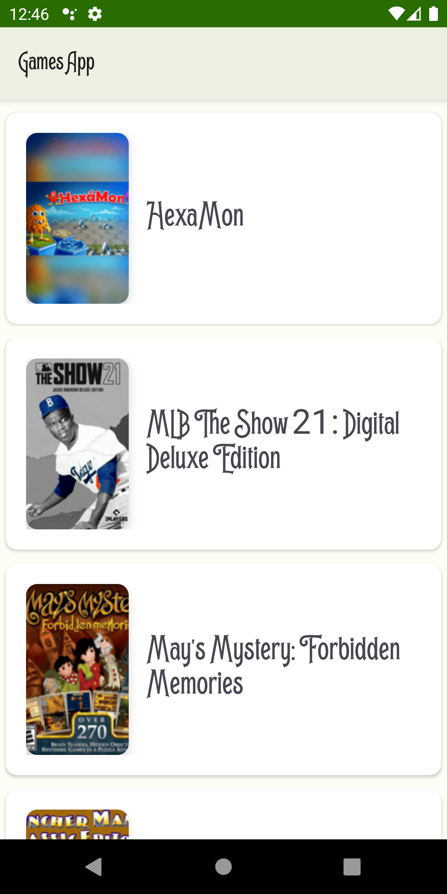
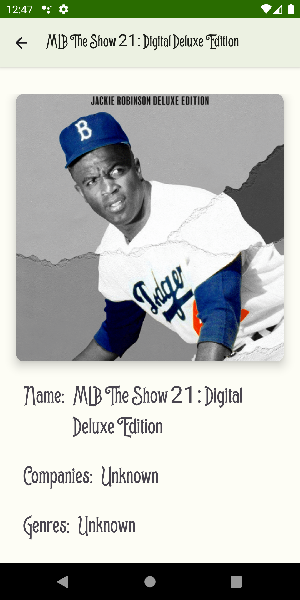

# Games App

## Description:

Android application developed in the Kotlin language.
The application shows a list of games from IGDB and when you click on a specific games, a new page opens with more details about the chosen game.
You can update the data in two ways: a pull to refresh the entire list or add more games to the actual list by getting to the end of the list scrolling down.
The data will be stored locally, so the app can be used offline. 

## Features:

- Retrofit
- Room
- Jetpack Viewmodel
- MVVM
- Clean Architecture
- Coroutines
- Dagger Hilt
- Material Design
- Glide
- SwipeRefreshLayout
- [IGDB API](https://github.com/husnjak/IGDB-API-JVM)

# Screens

## List of games

## Game detail

